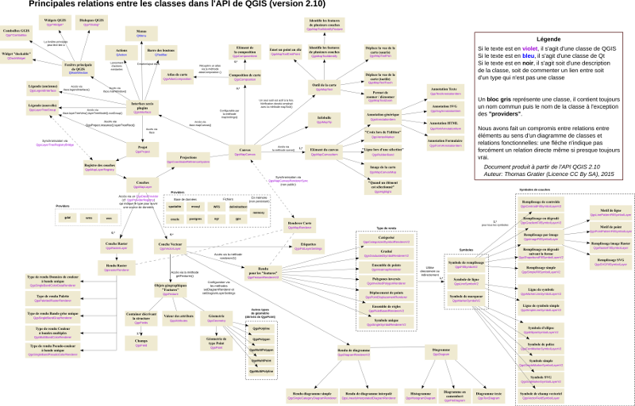
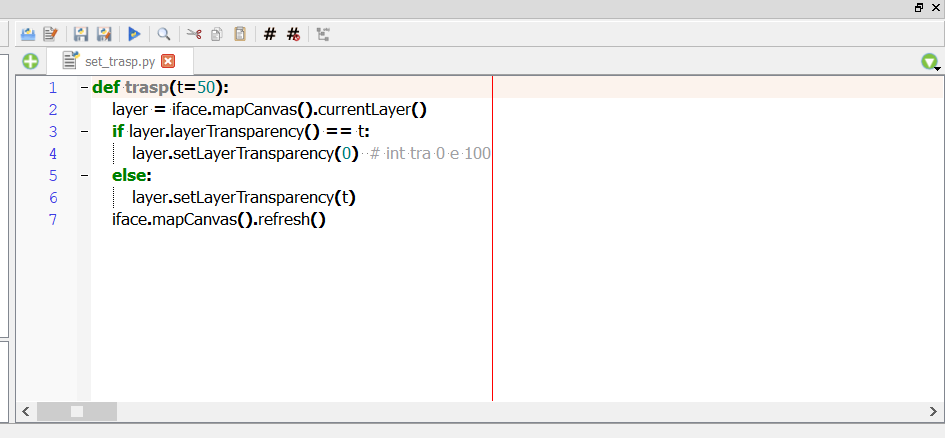
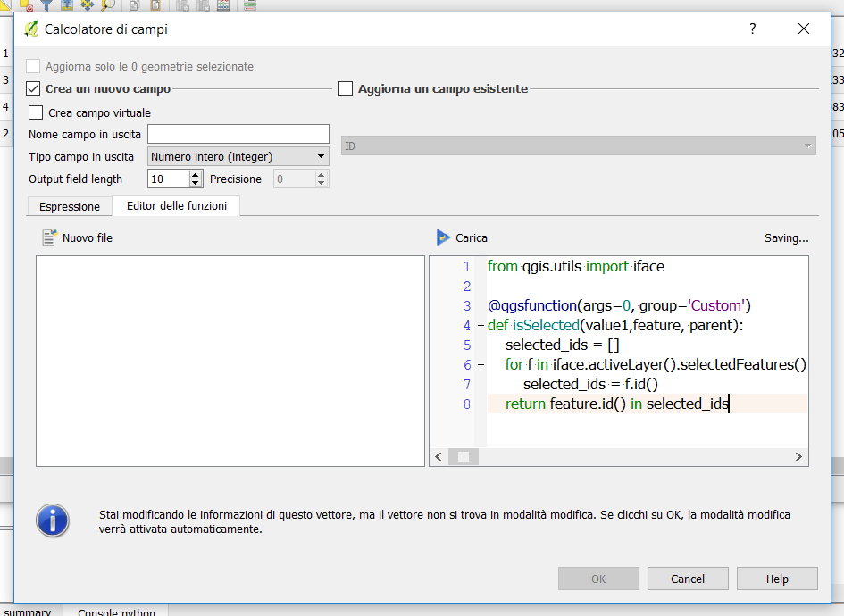
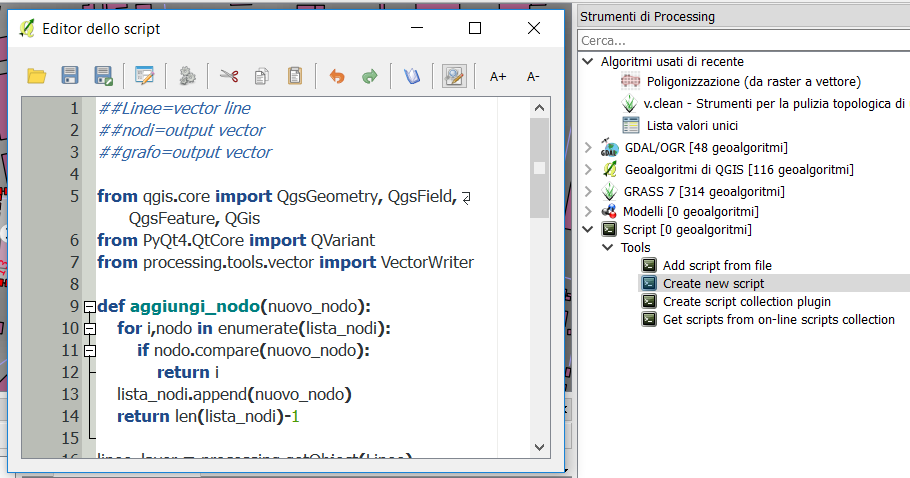

# PyQt e PyQGIS
QGIS è un'applicazione open source multipiattaforma (è disponibile per tutti i principali sistemi operativi) costruita per mezzo del framework di programmazione Qt
QGIS espone per mezzo di un'interfaccia di programmazione (API) le classi ed i metodi di funzionamento,
Qt e QGIS dispongono di librerie di collegamento a PYTHON (*bindings*) denominate PyQt e PyQGIS che consentono il controllo e la propgrammazione dell'applicazione per mezzo di codice interpretato in python
* QGIS2
    * Python 2.7/Qt 4
* QGIS3
   * Python 3.5/Qt 5

--

## Qt

Qt è un framework applicativo open-source sviluppato da Nokia per costruire interfacce utente grafiche (GUI) e sviluppare software. Qt è utilizzato in programmi come Google Earth, Virtual Box, Skype, Autodesk e Android. QGIS stesso è costruito con Qt. L'utilizzo di un framework applicativo come Qt velocizza il ciclo di sviluppo di un'applicazione e consente di sviluppare applicazioni multi-piattaforma.
### PyQt
il modulo di collegamento (*bindings*) si chiama PyQt e può essere importato in un programma Python per controllare i widget dell'interfaccia utente
[moduli di Qt](http://doc.qt.io/qt-4.8/modules.html)
[API di PyQt](http://pyqt.sourceforge.net/Docs/PyQt4/modules.html)


--

## PyQgis



[diagramma](https://raw.githubusercontent.com/webgeodatavore/qgis-class-diagram/master/diagramme_principal.png)

---

## PyQGIS - classi fondamentali

[documentazione API in C++](https://qgis.org/api)
[documentazione API in python](http://python.qgis.org/api)

* [QgisInterface](https://qgis.org/api/classQgisInterface.html): riferimenti dell'interfaccia utente:
* [QgsProject.instance()](https://qgis.org/api/classQgisInterface.html): è un oggetto singolare (singleton) e gestisce l'oggetto progetto corrente. incorpora [QgsMapLayerRegistry](https://qgis.org/api/2.18/classQgsMapLayerRegistry.html) di QGIS2
* [QgsMapCanvas()](https://qgis.org/api/classQgsMapCanvas.html): è accessibile da QgisInterface().mapCanvas() e gestisce la visualizzazione dei layer: sistemi di riferimento, zoom/pan, mapTools etc...
* [QgsLayerInterface()](http://qgis.org/api/2.18/classQgsLegendInterface.html): accessibile da QgisInterface().layerInterface() gestisce la legenda dei layers
* [QgsMapLayer()](https://qgis.org/api/classQgsMapLayer.html): si articola in QgsVectorLayer() e QgsRasterLayer() e gestisce la manipolazione dei layers
* [QgsFeature()](https://qgis.org/api/classQgsFeature.html): gestione delle singole entità in geometria e attributi
* [QgsGeometry()](https://qgis.org/api/classQgsGeometry.html): permette la manipolazione delle geometrie

---

# PyQgis in pratica

--

## Caricamento di Progetti e Layers

* [caricamento di un progetto](https://docs.qgis.org/testing/en/docs/pyqgis_developer_cookbook/loadproject.html)
* [caricamento di un layer vettoriale](https://docs.qgis.org/testing/en/docs/pyqgis_developer_cookbook/loadlayer.html#vector-layers)
* [caricamento di un layer raster](https://docs.qgis.org/testing/en/docs/pyqgis_developer_cookbook/loadlayer.html#raster-layers)
* [inserimento di un layer nel progetto corrente](https://docs.qgis.org/testing/en/docs/pyqgis_developer_cookbook/loadlayer.html#qgsproject-instance)

```python
project = QgsProject.instance() # l'oggetto è instanziato, viene usata l'istanza creata da QGIS
project.clear() #equivale a nuovo progetto
project.read('path ad un progetto')

vectorLayer = QgsVectorLayer('data_source', 'layer_name', 'provider_name') #provider_name = 'ogr' per sorgenti dati convenzionali
rasterLayer = QgsRasterLayer('data_source', 'layer_name', 'provider_name') #provider_name = 'gdal' per sorgenti dati convenzionali

QgsProject.instance().addMapLayer(vectorLayer) #QgsMapLayerRegistry
```

--

## Layers Vettoriali - acceso alle features

[Uso dei layers vettoriali](https://docs.qgis.org/testing/en/docs/pyqgis_developer_cookbook/vector.html#)

```python
#CARICAMENTO
layer = QgsVectorLayer('data_source', 'layer_name', 'provider_name') #caricamento
layer = iface.activeLayer() #layer correntemente attivo sulla legenda

#PROPRIETA' DEL LAYER
print (layer.extent()) #estensioni del layer

for field in layer.pendingFields():
    print (field.name(), field.typeName()) #stampa dei campi del layer

#ITERAZIONE
for feature in layer.getFeatures(): #tutte le feature del layer
    #qualinque azione da iterare per ogni feature

for feature in layer.selectedFeatures(): #tutte le features attualmente selezionate
    #qualinque azione da iterare per ogni feature

exp = QgsExpression("toponimo ILIKE '%lago%'")
request = QgsFeatureRequest(exp)
for feature in layer.getFeatures(request): #solo le feature che corrispondono all'espressione
    #qualinque azione da iterare per ogni feature

```

--

## Layers Vettoriali - oggetto QgsFeature

```python
#PROPRIETA'
feature.geometry() # la geometria legata alla feature (QgsGeometry)
feature['toponimo'] # accesso al campo "toponimo"
feature[3] # accesso al terzo campo
feature.id() #identificativo interno univoco ($id in espressioni)

#CREAZIONE
feature = QgsFeature() #creazione di una feature vuota senza definizioni dei campi #bisogna crearli ex novo
feature = QgsFeature(layer.pendingFields()) #creazione di una feature contente i campi del layer

#MODIFICA
feature.setAttribute('area', 100.0) #settaggio del campo 'area' con il valore 100.0
feature.setAttribute(4, 100.0) #settaggio del quarto campo con il valore 100.0
feature.setGeometry(QgsGeometry.fromPoint(QgsPoint(123, 456)))


```

--

## Layers Vettoriali - modifica

```python
#PREPARAZIONE ALLE MODIFICHE
layer.startEditing() #preparazione dell'edit buffer per la registrazione delle modifiche

#NUOVE FEATURES
layer.addFeature(feature)

#CANCELLAZIONE FEATURES
layer.deleteFeature(feature.id())

#MODIFICA FEATURES ESISTENTI
layer.changeGeometry(fid, geometry)
layer.changeAttributeValue(fid, fieldIndex, value)
oppure una volta ottenuta la feature desiderata
feature.setAttribute('area', 100.0)
feature.setGeometry(QgsGeometry.fromPoint(QgsPoint(123, 456)))

#AGGIUNTA ATTRIBUTI
layer.addAttribute(QgsField("mytext", QVariant.String))

#CANCELLAZIONE ATTRIBUTI
layer.deleteAttribute(indice_campo)

#FINE DELLE MODIFICHE
layer.commitCHanges() #scrittura sulla sorgente dati delle modifiche effettuate
layer.rollbackChanges() #cancellazione delle modifiche effettuate
```

--

## layers vettoriali - oggetto geometria

[geometria WKT - Well-Known Text](https://it.wikipedia.org/wiki/Well-Known_Text)

[geometria geojson](http://geojson.org/)

```python
#METODI COSTRUTTORI
geom = QgsGeometry()
geom = QgsGeometry.	fromPointXY (QgsPointXY(12,45))

geom = QgsGeometry.fromWKT('POINT(12 45)')
geom = QgsGeometry.fromWKT('POLYGON((1 1,5 1,5 5,1 5,1 1),(2 2, 3 2, 3 3, 2 3,2 2))')

#MANIPOLAZIONE
geom2 = geom1.simplify(2.0)
geom3 = geom1.buffer(5)
geom4 = geom1.centroid()
geom5 = geom1.clipped(QgsRectangle(1,1,4,6))
geom6 = intersection(geom1)

#INTERROGAZIONE
geom1.isGeosValid() #verifica correttezza geometrica
geom1.intersects(geom2) #boolean True or False
geom1.contains(geom2)
geom1.within(geom2)
geom1.length() # Double lunghezza di un segmento
geom.distance(geom2) #double distanza minima tra due geometrie

#TRASFORMAZIONE
geom1.asWkt() trasformazione in WKT
geom1.asJson() trasformazione in oggetto geometria di geojson

```

---

# esercitazioni di personalizzazione con python

* script
* funzioni personalizzate nel calcolatore di espressioni
* script di processing


[Dataset di esempio](doc/dataset.zip)

---

## scripts



--

### funzione per variare la trasparenza di un layer

```python
#versione per QGIS2
def trasp(t=50):
    layer = iface.mapCanvas().currentLayer()
    if layer.layerTransparency() == t:
        layer.setLayerTransparency(0)  # int tra 0 e 100
    else:
        layer.setLayerTransparency(t)
    iface.mapCanvas().refresh()
```
```python
#versione per QGIS3
def trasp(t=0.5):
    layer = iface.activeLayer()
    if layer.opacity() == t:
        layer.setOpacity(1)  # double tra 0 e 1
    else:
        layer.setOpacity(t)
    iface.mapCanvas().refresh()
```

--

### procedura per stampare i dettagli di un layer

```python
#versione per QGIS2
from qgis.core import QGis, QgsPoint
#layer = iface.addVectorLayer("/path.shp", "nome", "ogr")
layer = iface.activeLayer() #caricamento
if not layer or not layer.isValid():
  print "Layer non valido!"
else:
    #QgsMapLayerRegistry.instance().addMapLayer(layer) #registrazione
    informazioni=[]
    for feature in layer.getFeatures(): #accesso alle features
        info = [feature.id()]
        geom = feature.geometry()
        if geom.type() == QGis.Point:
            info.append("distanza")
            info.append(geom.distance(QgsGeometry.fromPoint(QgsPoint(0.0,0.0))))
        elif geom.type() == QGis.Line:
            info.append("Lunghezza")
            info.append(geom.length())
        elif geom.type() == QGis.Polygon:
            info.append("Area")
            info.append(geom.area)
        info += feature.attributes()
        informazioni.append(info)
    print informazioni
```
```python
#versione per QGIS3
from qgis.core import  QgsWkbTypes, QgsPoint
layer = iface.activeLayer() #caricamento
if not layer or not layer.isValid():
  print ("Layer non valido!")
QgsProject.instance().addMapLayer(layer) #registrazione
informazioni=[]
for feature in layer.getFeatures(): #accesso alle features
    info = [feature.id()]
    geom = feature.geometry()
    if geom.type() ==  QgsWkbTypes.Point:
        info.append("distanza")
        info.append(geom.distance(QgsPoint(0,0)))
    elif geom.type() ==  QgsWkbTypes.LineString:
        info.append("Lunghezza")
        info.append(geom.length())
    elif geom.type() ==  QgsWkbTypes.Polygon:
        info.append("Area")
        info.append(geom.area)
    info += feature.attributes()
    informazioni.append(info)
print (informazioni)
```

---

## funzioni personalizzate

[Documentazione ufficiale](https://docs.qgis.org/2.18/en/docs/user_manual/working_with_vector/expression.html#function-editor)


--

## funzione booleana vera per feature selezionate

```python
from qgis.utils import iface

@qgsfunction(args=0, group='Custom', usesgeometry=False)
def isSelected(value1,feature, parent):
    selected_ids = []
    for f in iface.activeLayer().selectedFeatures():
        selected_ids = f.id()
    return feature.id() in selected_ids
```

--

## funzione che restituisce le coordinate del centro dello schermo

```python
from qgis.utils import iface
from qgis.core import QgsGeometry, QgsPoint

@qgsfunction(args=0, group='Custom')
def mapCenter(value1,feature, parent):
  x = iface.mapCanvas().extent().center().x()
  y = iface.mapCanvas().extent().center().y()
  return QgsGeometry.fromPointXY(QgsPointXY(x,y))
```

---

## script di processing

[documentazione ufficiale](https://docs.qgis.org/2.8/en/docs/user_manual/processing/scripts.html#writing-new-processing-algorithms-as-python-scripts)
[tutorial per QGIS2](http://www.qgistutorials.com/it/docs/processing_python_scripts.html)



--

## Dai Modelli agli script di Processing
i modelli di processing possono venire esportati come script in python soccessivamente modificabili:
```python
##Points2Polygon=name
##TABLEFIELD_GROUPBY=fieldVECTORLAYER_POINTSLAYER
##TABLEFIELD_ORDERBY=fieldVECTORLAYER_POINTSLAYER
##VECTORLAYER_POINTSLAYER=vector
##mypolygons=output vector
outputs_QGISPOINTSTOPATH_1=processing.runalg('qgis:pointstopath', VECTORLAYER_POINTSLAYER,TABLEFIELD_GROUPBY,TABLEFIELD_ORDERBY,None,None,None)
outputs_QGISLINESTOPOLYGONS_1=processing.runalg('qgis:linestopolygons', outputs_QGISPOINTSTOPATH_1['OUTPUT_LINES'],mypolygons)
```
Modelli e Script di Processing possono essere importati dal repository di QGIS


--

## creazione di un nuovo layer dalle feature selezionate

In QGIS3 il framework è stato completamente riscritto in C++ per esigenze prestazionali e per consentire l'esecuzione in background. Però l'API è completamente cambiata, più complessa, poco documentata e soggetta a futuri cambiamenti. Quindi facciamo riferimento per processing ancora al framework di QGIS2

```python
##Vector=group
##input=vector
##output=output vector

from qgis.core import *
from processing.tools.vector import VectorWriter

vectorLayer = processing.getObject(input)

provider = vectorLayer.dataProvider()

writer = VectorWriter(output, None, vectorLayer.pendingFields(),
                      provider.geometryType(), vectorLayer.crs())

features = processing.features(vectorLayer)
for feat in features:
    writer.addFeature(feat)

del writer

```

--

[dtm](py/antelao.tif)

```python
##dtm=raster
##input=vector
##output=output vector

from PyQt4.QtCore import QVariant
from qgis.core import *
from processing.tools.vector import VectorWriter

vectorLayer = processing.getObject(input)
dtmLayer = processing.getObject(dtm)

fields=QgsFields()
fields.append(QgsField('elevation', QVariant.Double))
fields.append(QgsField('id_polyline', QVariant.Int))

pointSamplewriter = VectorWriter(output, None, fields,
                      QgsWKBTypes.Point, vectorLayer.crs())

features = processing.features(vectorLayer)
for feat in features:
    for point in feat.geometry().asPolyline():
        elevFeat = QgsFeature(fields)
        elevValue = dtmLayer.dataProvider().identify(point, QgsRaster.IdentifyFormatValue).results()[1]
        elevFeat['elevation'] = elevValue
        elevFeat['id_polyline'] = feat.id()
        elevGeom = QgsGeometry.fromPoint(point)
        elevFeat.setGeometry(elevGeom)
        pointSamplewriter.addFeature(elevFeat)

del pointSamplewriter

```

--

script di processing modificato nella lezione 3 per misurare i punti lungo le polilineee. attenti a non definire misure <= 0

```python
##dtm=raster
##input=vector
##measure=number 50
##output=output vector

from PyQt4.QtCore import QVariant
from qgis.core import *
from processing.tools.vector import VectorWriter

vectorLayer = processing.getObject(input)
dtmLayer = processing.getObject(dtm)
measureStep = measure

fields=QgsFields()
fields.append(QgsField('elevation', QVariant.Double))
fields.append(QgsField('id_polyline', QVariant.Int))

pointSamplewriter = VectorWriter(output, None, fields,
                      QgsWKBTypes.Point, vectorLayer.crs())

features = processing.features(vectorLayer)
for feat in features:
    currentLen = 0
    while currentLen < feat.geometry().length():
        point = feat.geometry().interpolate(currentLen).asPoint()
        elevFeat = QgsFeature(fields)
        elevValue = dtmLayer.dataProvider().identify(point, QgsRaster.IdentifyFormatValue).results()[1]
        elevFeat['elevation'] = elevValue
        elevFeat['id_polyline'] = feat.id()
        elevGeom = QgsGeometry.fromPoint(point)
        elevFeat.setGeometry(elevGeom)
        pointSamplewriter.addFeature(elevFeat)
        currentLen += measureStep

del pointSamplewriter

```

--

## uso del framework processing

[documentazione ufficiale] (https://docs.qgis.org/2.18/en/docs/user_manual/processing/console.html)

```python
>>> import processing
# eseguire un algoritmo
>>> processing.runalg('nome algoritmo', par1, par2, ..., parN)

# lista degli algoritmi disponibili
>>> processing.alglist()

# lista dei parametri necessari per runalg
>>> processing.alghelp('nome algoritmo')

```

--

## creazione di un grafo origine/destinazione in QGIS2

```python
##Linee=vector line
##nodi=output vector
##grafo=output vector

from qgis.core import QgsGeometry, QgsField, QgsFeature, QGis
from PyQt4.QtCore import QVariant
from processing.tools.vector import VectorWriter

def aggiungi_nodo(nuovo_nodo):
    for i,nodo in enumerate(lista_nodi):
        if nodo.compare(nuovo_nodo):
            return i
    lista_nodi.append(nuovo_nodo)
    return len(lista_nodi)-1

linee_layer = processing.getObject(Linee)

grafo_fields = [
    QgsField("rif_id", QVariant.Int),
    QgsField("in_id", QVariant.Int),
    QgsField("out_id", QVariant.Int)
]
grafo_writer = VectorWriter(grafo, None, grafo_fields, QGis.WKBMultiLineString, linee_layer.crs())

nodi_fields = [QgsField("nodo_id", QVariant.Int)]
nodi_writer = VectorWriter(nodi, None, nodi_fields, QGis.WKBMultiPoint, linee_layer.crs())

i = 0
n = linee_layer.featureCount()
lista_nodi = []
progress.setText("Individuazione dei vertici degli archi del grafo ...")

for k,feature in enumerate(processing.features(linee_layer)):
    progress.setPercentage(int(100*i/n))
    i += 1
    lista_vertici = feature.geometry().asPolyline()
    grafo_feature = QgsFeature()
    attributi =[feature.id()]
    grafo_feature.setGeometry(feature.geometry())
    for campo, estremo in ({1:lista_vertici[0],2:lista_vertici[-1]}).items():
        id_nodo = aggiungi_nodo(estremo)
        attributi.append(id_nodo)
    grafo_feature.setAttributes(attributi)
    grafo_writer.addFeature(grafo_feature)

i = 0
n = len(lista_nodi)
progress.setText("Creazione dei nodi ...")

for i, nodo in enumerate(lista_nodi):
    progress.setPercentage(int(100*i/n))
    nodo_feature = QgsFeature()
    nodo_feature.setAttributes([i])
    nodo_feature.setGeometry(QgsGeometry.fromPoint(nodo))
    nodi_writer.addFeature(nodo_feature)

del nodi_writer
del grafo_writer

```
