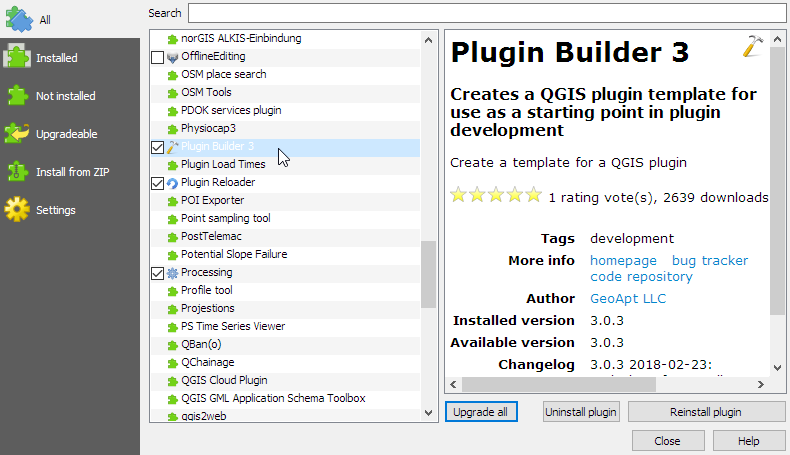
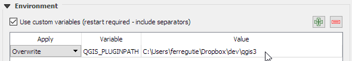
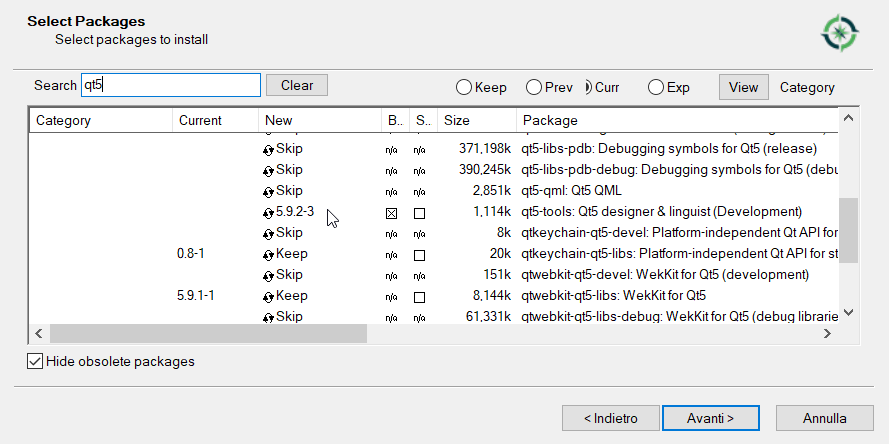
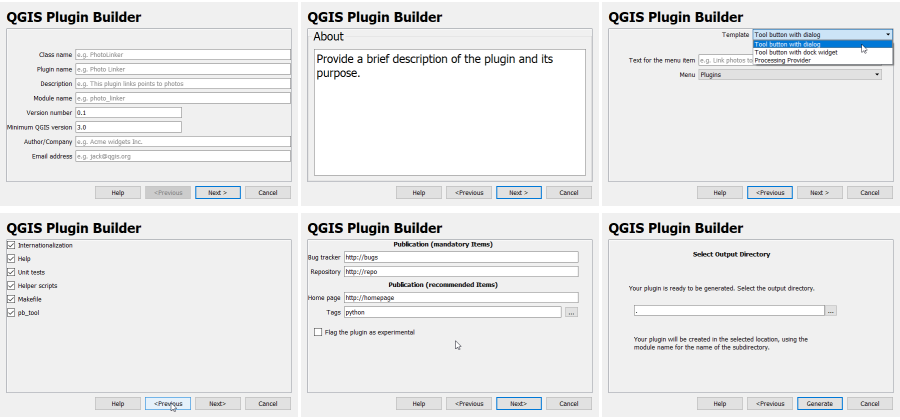
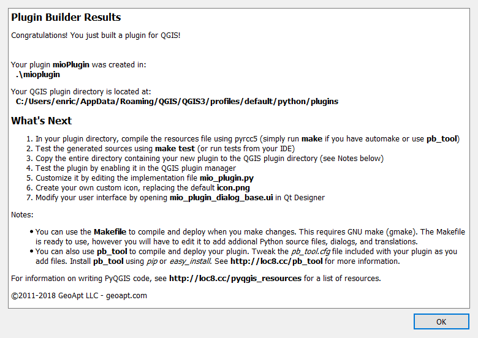
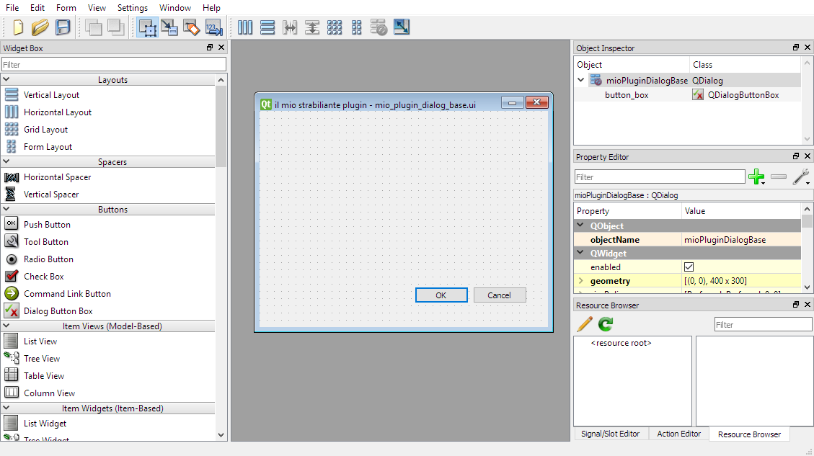
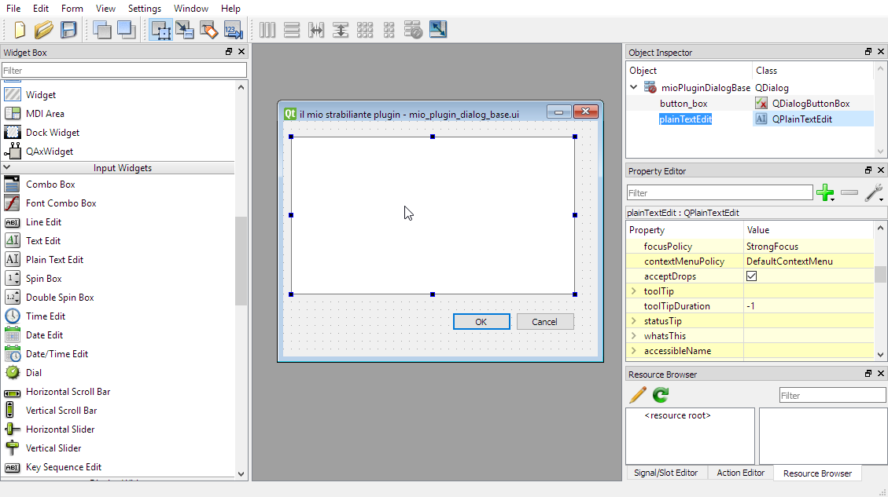
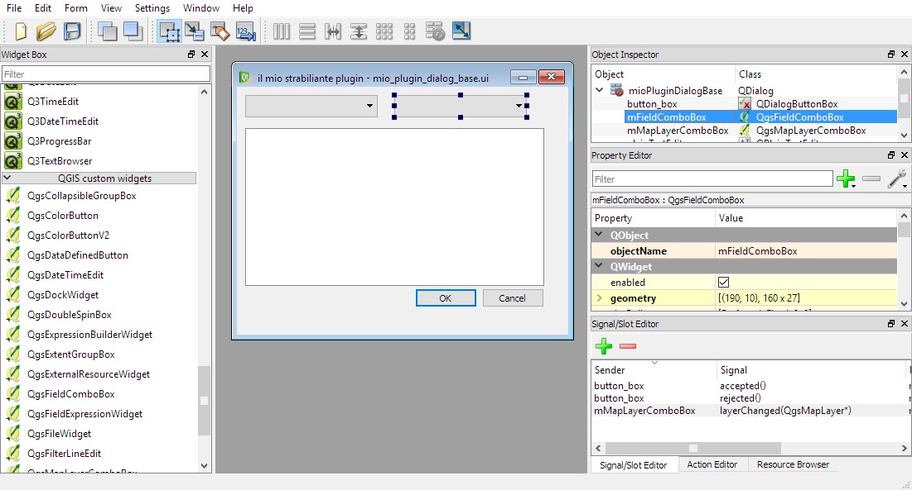

# I plugins di QGIS3

--

## Installazione



--

* directory di installazione

```console
QGIS2
[homedir]\.qgis2\python\plugins

QGIS3
[homedir]\.qgis3\python\plugins

QGIS3 - windows
[homedir]\AppData\roaming\QGIS3\python\plugins
```

* directory alternativa QGIS_PLUGINPATH in opzioni - ambiente

* installazione diretta da file zip (solo QGIS3)

---

# struttura di un plugin

--

## plugin factory a metadata.txt

La [struttura minima per un plugin](https://github.com/wonder-sk/qgis-minimal-plugin) prevede la presenza di due files, __init__.py e metadata.txt:

__init__.py

```python.py
from PyQt4.QtGui import *
from PyQt4.QtCore import *

def classFactory(iface):
    return MinimalPlugin(iface)


class MinimalPlugin:
    def __init__(self, iface):
        self.iface = iface

    def initGui(self):
        self.action = QAction(u'Go!', self.iface.mainWindow())
        self.action.triggered.connect(self.run)
        self.iface.addToolBarIcon(self.action)

    def unload(self):
        self.iface.removeToolBarIcon(self.action)
        del self.action

    def run(self):
QMessageBox.information(None, u'Minimal plugin', u'Do something useful here')
```

--

metadata.txt

```console
[general]
name=Minimal
description=Minimal plugin
version=1.0
qgisMinimumVersion=2.0
author=Martin Dobias
email=wonder.sk@gmail.com
```

... però la tipica installazione di un plugin è più complessa e prevede la suddivisione in moduli con la separazione tra logica QGIS e logica di interfaccia QT e si troveranno tipicamente i seguenti files:

```console
__init__.py               modulo di inizializzazione con plugin factory
immagini .png o .jpg      icone per l'interfaccia (button bar etc)
[modulo_principale].py    richiamato da plugin factory
[dialogo_principale].py   contiene la logica dell'interfaccia utente
[dialogo_principale].ui   contiene la definizione dell'interfaccia utente
resources.rc              talvolta contiene le risorse (immagini ed )
metadata.txt
```

---

# prerequisiti per la creazione di plugin per QGIS

--

## QGIS2 ed osgeo4w

Gli strumenti per la creazione di plugins per QGIS2 sono gia presenti nell'installazione base di OSGEO4W e sono inoltre impostati tutti i path correttamente in modo da far funzionare insieme tutti gli strumenti necessari:

* python2.7
* Qt4
* pyrcc4: compilatore di risorse
* pyuic4
* QT4 Designer con i QGIS widgets
* plugin builder

--

## migrazione a QGIS3

la riga di comando predefinita di OSGEO4W deve essere opportunamente istruita per l'uso dei nuovi strumenti di sviluppo necessari per i plugin di QGIS3:

* eseguire lo script di configurazione di ambiente di python 3 e qt5:

```console
py3_env.bat
qt5_env.bat
```
* installare i qt5-tools con il setup di osgeo4w
  * pyrcc5
  * pyuic5
  * QT5 Designer (QGIS widgets non compaiono)

--

## Installazione dei qt5-tools con il setup di osgeo4w



--

## QGIS3 in linux

UBUNTU
```console
sudo apt-get install qttools5-dev-tools
```

---

# plugin builder

--

## creazione assistita

è un plugin realizzato e mantenuto da Gary Sherman fondatore del progetto QGIS per facilitare la creazione di plugin, recentemente portato a QGIS3.
Permette di creare il template di plugin a partire dalla configurazione di alcuni dati di descrizione del plugin da realizzare

--

## configurazione



--

## generazione



--

## contenuto del plugin

[contenuto del plugin appena generato](py/mioplugin.zip)

```console
mioplugin                        cartella del plugin
│   icon.png                     icona per buttonbar
│   Makefile                     istruzioni per il comando make
│   metadata.txt                 metadati del plugin (autore versione etc...)
│   mio_plugin.py                classe base
│   mio_plugin_dialog.py         classe per la gestione della ui
│   mio_plugin_dialog_base.ui    file di descrizione della ui
│   pb_tool.cfg
│   plugin_upload.py             upload al repository di qgis.org
│   pylintrc
│   README.html                  informazioni sul plugin
│   README.txt                   informazioni sul plugin
│   resources.qrc                file di risorsa qt
│   __init__.py                  plugin factory
│
├───help                         directory contenente la documentazione sphinx
├───i18n                         directory contente i files per l'internazionalizzazione
├───scripts                      directory contente gli script di make
└───test                         directory contenente la unit test
```
--

## il file resources.qrc

```console

<RCC>
    <qresource prefix="/plugins/mio_plugin" >
        <file>icon.png</file>
    </qresource>
</RCC>

```

--

## compilazione

http://g-sherman.github.io/Qgis-Plugin-Builder/


compilazione manuale

```console
pyrcc5 -o resources.py resources.qrc
```


Queste ed altre procedure possono essere automatizzate usando make: dalle istruzioni del plugin

```console
clean:         Delete the compiled UI and resource files
compile:       Compile the resource and UI files. This is the default target.
dclean:        Same as derase but also removes any .svn entries
deploy:        Deploy the plugin
derase:        Remove the deployed plugin
doc:           Build the documentation using Sphinx
package:       Package the plugin using git archive
transclean:    Delete all .qm (translation) files
transcompile:  Compile translation files into .qm format
transup:       Update the .ts (translation) files
upload:        Upload the plugin to the QGIS repository
zip:           Deploy the plugin and create a zip file suitable for uploading to the QGIS repository
test:          Run unit tests and produce a coverage report.
pep8:          Run python PEP8 check and produce a report.
pylint:        Run python pylint check and produce a report listing any violations.
```

---

# QT Designer

--

QT designer è uno strumento grafico per la definizione di interfacce utente in QT. Legge e scrive i files .ui:



--

Con QT designer possiamo editare il file .ui prodotto dal plugin builder (nell'esempio è il file mio_plugin_dialog_base.ui) ed aggiungerci dei widgets di QT. In particolare ci interessa aggiungere una finestra di testo per trasformare in plugin lo script per stampare i dettagli di un layer visto precedentemente:



--

In QT designer è inoltre possibile definire i nomi dei widgets e le loro proprietà principali

E' inoltre possibile aggiungere (in QGIS2, non ancora in QGIS3) dei custom widgets di QGIS creati appositamente per aggiungere funzionalità alle interfacce create con QT designer



--

ultime correzioni per QGIS3!! e deployment

putroppo la migrazione a QGIS3 per python non è ancora completamente automatizzata, ed è necessario andate ad editare manualmente due righe del file .ui appena modificato con QT designer per consentire a qgis di caricare correttamente le classi dei custom widgets:

aprire con un editor il file mio_plugin_dialog_base.ui

ci troveremo di fronte ad un tipico file xml e dovremo sostituire tutte le occorrenze della riga

```xml
<header>qgsmaplayercombobox.h</header>
```

con la seguente riga:
```xml
<header>qgis.gui</header>
```

a questo punto possiamo copiare la cartella del plugin nella directory che contiene i plugins di QGIS (dentro QGIS_PLUGINPATH se abbiamo configurato la variabile d'ambiente) riavviare QGIS ed attivare il plugin (il plugin sarà presente fra i plugin installati)

---

# QT framework

--

### Qt

Qt è un framework applicativo open-source sviluppato da Nokia per costruire interfacce utente grafiche (GUI) e sviluppare software. Qt è utilizzato in programmi come Google Earth, Virtual Box, Skype, Autodesk e Android. QGIS stesso è costruito con Qt. L'utilizzo di un framework applicativo come Qt velocizza il ciclo di sviluppo di un'applicazione e consente di sviluppare applicazioni multi-piattaforma.
### PyQt
il modulo di collegamento (*bindings*) si chiama PyQt e può essere importato in un programma Python per controllare i widget dell'interfaccia utente
[moduli di Qt](https://doc.qt.io/qt-5.10/qtmodules.html)
[API di PyQt](http://pyqt.sourceforge.net/Docs/PyQt5/modules.html)

--

## Uso dei widgets QT

http://pyqt.sourceforge.net/Docs/PyQt5/signals_slots.html

Per programmare l'interfaccia QT, bisogna rendere sensibili gli eventi causati dall'interfaccia. Ovvero bisogna intercettare i segnali che sono scatenati da eventi predefiniti sui widgets dell'interfaccia (click per esempio) e collegarli ad uno slot, ovvero una funzione capace di gestire l'evento.

Per esempio [QDialogButtonBox](https://doc.qt.io/qt-5/qdialogbuttonbox.html) usato dalla nostra finestra di dialog dispone dei segnali accepted() o rejected()

nel nostro esempio il [custom widget contente i layers](https://qgis.org/api/classQgsMapLayerComboBox.html) correnti scatena un segnale layerChanged che viene connesso allo slot setLayer del [custom widget contente i campi](https://qgis.org/api/classQgsFieldComboBox.html) del layer scelto. una volta selezionato il campo, viene emesso il segnale fieldChanged che invierà allo slot che definiremo il nome del campo

---

# implementazione dell interfaccia utente

--

## definiamo uno slot per field changed

editare il file mio_plugin_dialog.py

```python
# aggiungere l'impoartazioni dei moduli opportuni nell'instestazione
from qgis.core import  QgsWkbTypes, QgsPoint

# aggiungere ad __init__.py connessione al segnale fieldChanged
        self.mFieldComboBox.fieldChanged.connect(self.scrivi_proprieta_layer)

# aggiungere alla classe di dialogo
    def scrivi_proprieta_layer(self,nomeCampo):
        layer = self.mMapLayerComboBox.	currentLayer()
        if not layer or not layer.isValid():
          print ("Layer non valido!")
        for feature in layer.getFeatures(): #accesso alle features
            info = "'id':%d " % feature.id()
            geom = feature.geometry()
            if geom.type() ==  QgsWkbTypes.Point:
                info += "distanza da 00: %.1f " % geom.distance(QgsPoint(0,0))
            elif geom.type() ==  QgsWkbTypes.LineString:
                info += "Lunghezza %.1f " % geom.length()
            elif geom.type() ==  QgsWkbTypes.Polygon:
                info += "Area %.1f " % geom.area()
            info += "%s: %s\n" % (nomeCampo,str(feature[nomeCampo]))
            self.plainTextEdit.appendPlainText(info)

```
[alla fine questo è il risultato](py/mioplugin/mio_plugin_dialog.py)

--

## altri strumenti utili per lo sviluppatore di python in qgis:

* [plugin reloader](http://plugins.qgis.org/plugins/plugin_reloader/)
* [first aid](http://plugins.qgis.org/plugins/firstaid/)
* [remote debug](http://plugins.qgis.org/plugins/remotedebug/) da usare insieme a [winpdb](http://winpdb.org/) o altri IDE che permettono il remote debugging (per esempio [eclipse con pydev](https://docs.qgis.org/testing/en/docs/pyqgis_developer_cookbook/ide_debugging.html#debugging-using-eclipse-and-pydev)) (solo QGIS2 per ora)
* [winpdb con rpdb2](http://winpdb.org/docs/embedded-debugging/), introducendo nel codice opportuni segnali per bloccare il flusso di esecuzione:
