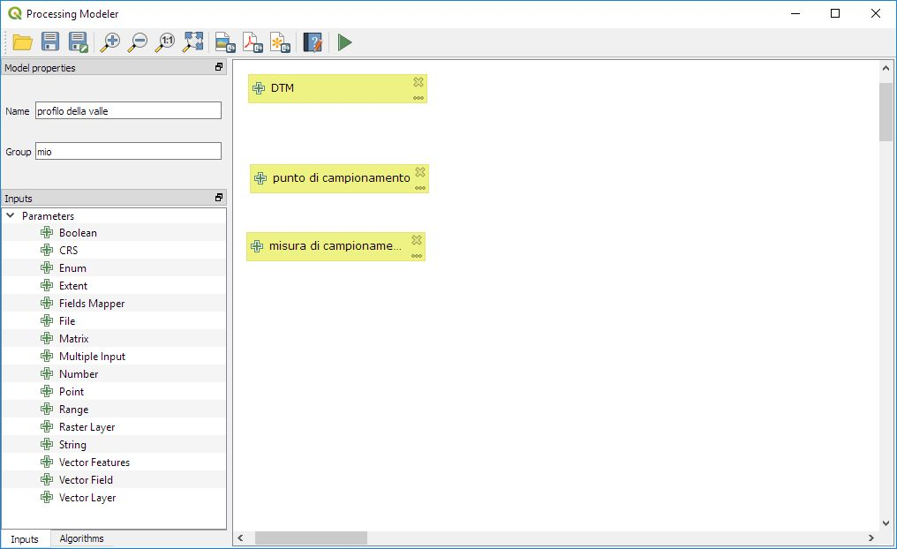
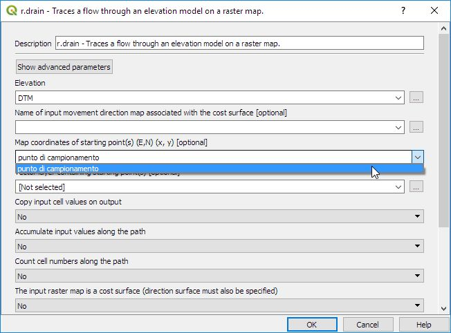
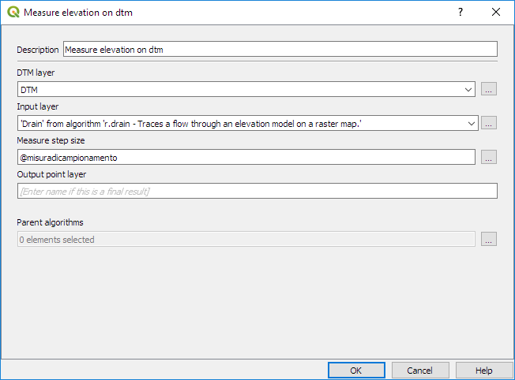
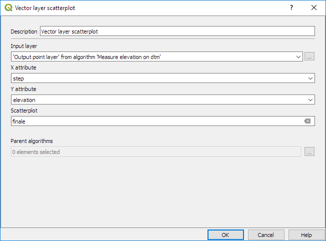
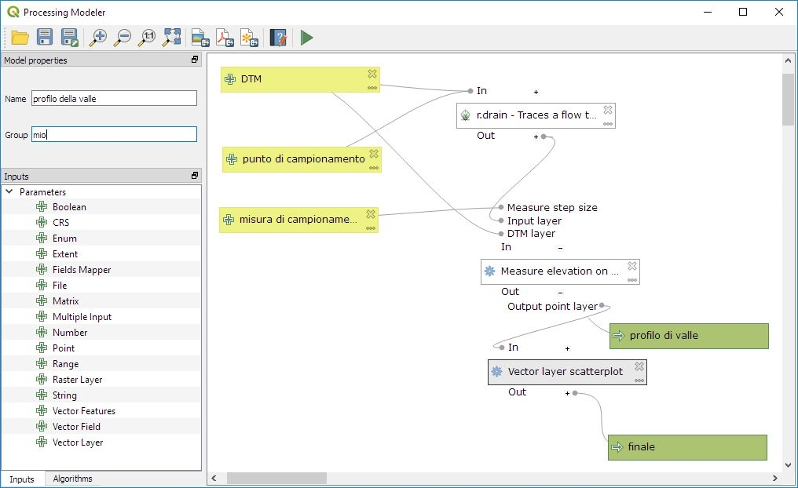
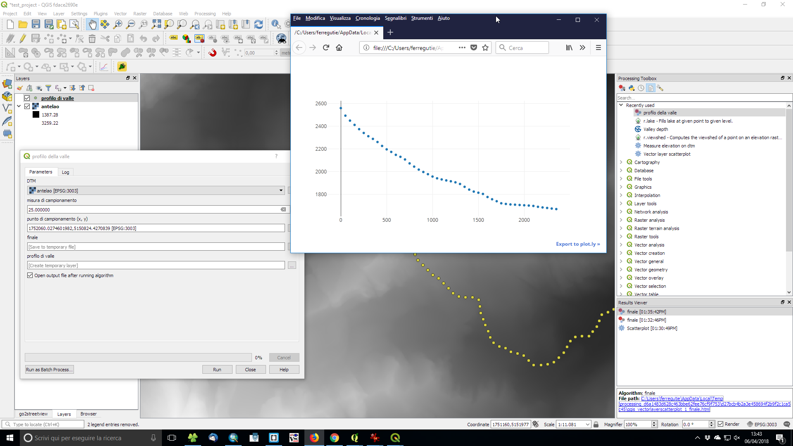
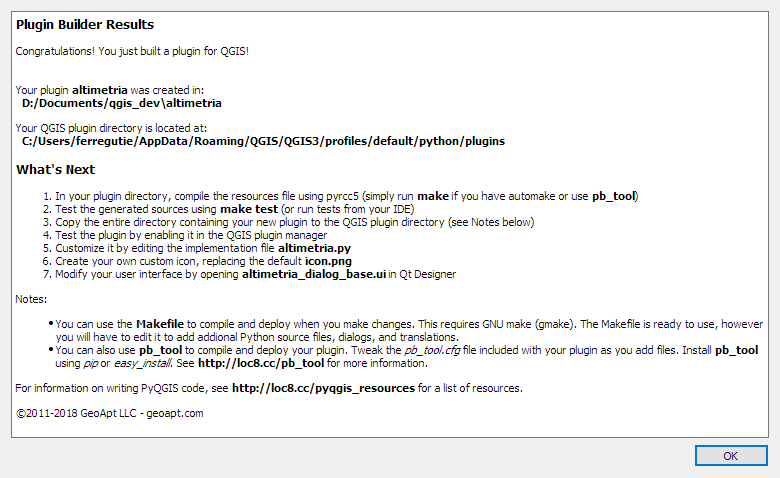
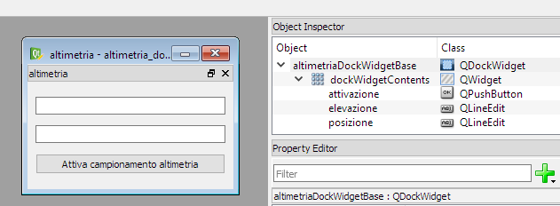
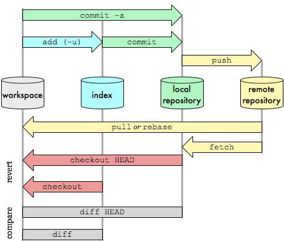
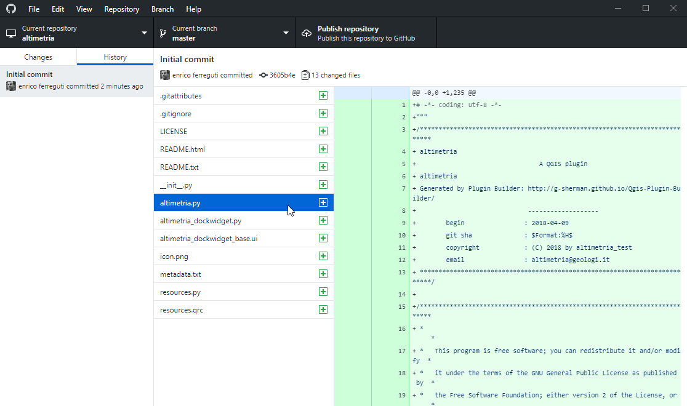

# esercitazioni pratiche di personalizzazione di QGIS

* modeler di QGIS: concatenare algoritmi di processing per ottenere nuovi comandi personalizzati
* realizzare un plugin di QGIS da zero
* collaborare allo sviluppo del software open source

---

# modeler di QGIS

--

## concatenare algoritmi di processing per ottenere nuovi comandi personalizzati

il "graphic modeler" o modellatore grafico è uno strumento potente di QGIS che permette di concatenare gli algoritmi di processing in cascata tra loro, usando i parametri di uscita di un algoritmo come parametri di entrata per un'altro algoritmo. Lo strumento si ispira al modelbuilder di ArcMap, di cui conserva la semplicità.
In QGIS2 i modelli possono essere convertiti in script python per essere ulteriormente personalizzate. In QGIS3 la conversione non è ancora possibile ed è auspicabile che tale funzione possa essere inserita nelle prossime versioni.

E' possibile richiamare il modellatore dal menu o dal toolbox di processing.

--

## Esercitazione determinare un grafico del profilo di valle

* obiettivo:
 * tracciare il profilo altimetrico del percorso più breve verso valle a partire da un dtm

* strumenti:
 * algoritmo "r.drain" di GRASS: permette di tracciare il percorso più breve verso valle a partire da un punto da specificare sullo schermo
 * algoritmo personalizzato in python creato nella scorsa lezione che permette di campionare l'elevazione su un dtm lungo una linea di input
 * algoritmo "Vector layer scatterplot": traccia un grafico XY a partire dai campi di un layer di input

--

## Passi operativi. definizione dei parametri

1. scaricare il file [08_raster_proc_QGIS3.py](../20180317/py/08_raster_proc_QGIS3.py) ed installarlo come algoritmo tramite l'apposito comando dalla toolbox di processing. L'algoritmo fornisce in output un file di punti con tre attributi: id_poly: con il riferimento all'id della polilinea generatrice, elevation: elevazione in metri letta dal dtm, step: distanza dall'origine della polilinea

1. aprire il graphic modeler di processing e definire 3 parametri:
 1. "DTM" come raster layer (Layer raster)
 1. "punto di campionamento" come Point (Punto)
 1. "misura di campionamento" come Number (numero)

1. definire il nome ed il gruppo da attribuire al modello

--



--

1. passare alla scheda degli algoritmi

1. trascinare r.drain assegnando il parametro "DTM" come layer di elevazione ed il parametro "punto di campionamento" come coordinate del punto di partenza tralasciando gli altri parametri opzionali




--

* inserire l'algoritmo "measure elevation on dtm" trascinandolo dagli script utente
 * definire attribuire il layer dtm di input dal parametro dtm
 * definire il layer vettoriale di input dall'output di r.drain
 * definire la Measure step size come la variabile @misuradicampionamento: può anche essere un valore calcolato, infatti premendo sul bottone di definizione "..." appare la tipica finestra del calcolatore dei campi
 * è possibile definire l'output del modello, per esempio come "profilo di valle", in questo modo avremo un output finale supplementare. Se l'output non viene dichiarato sarà trattato come parametro temporaneo intermedio non disponibile all'utente



--

* inserire l'algoritmo "Vector layer scatterplot"
   * definire input layer dall'output di "Measure elevation on dtm"
   * inserire il nome del campo "X attribute" digitando "step": le ascisse vengono definite come distanza dal punto di campionamento
   * inserire il nome del campo "Y attribute" digitando "elevation": le ordinate vengono definite come elevazione misurata sul dtm



--

* salvare il modello. il modello finale è esportabile e può essere distribuito ad altri utenti: [profilo_di_valle.model3](doc/profilo_di_valle.model3)



--

## Uso del modello

il modello può essere eseguito dalla toolbox di processing sotto la voce modelli ed applicato usando il dtm già usato nelle precedenti lezioni: [antelao.tif](../20180317/py/antelao.tif)



---

# un nuovo plugin di QGIS

--

## plugin di estrazione altimetrica dal sito del ministero dell'ambiente

Un classico campo di utilizzo dei plugin di QGIS è l'accesso a informazioni remote tramite internet. l'obiettivo dell'esercitazione è creare un nuovo plugin di QGIS3 per determinare l'elevazione di un punto sullo schermo per mezzo del servizio cartografico del ministero dell'ambiente.

La creazione del plugin si articola nelle seguenti attività:
* creazione della struttura del plugin tramite plugin builder
* disegno dell'interfaccia utente
* compilazione delle risorse ed installazione in QGIS
* creazione di una procedure di interrogazione al server del ministero dell'ambiente
* creazione della procedure per intercettare il click sullo schermo
* logica per il trattamento dei risultati ricevuti


--

## Plugin builder

1. assicurarsi di aver opportunamente configurato la variabile QGIS_PLUGINPATH su una directory locale di sviluppo, per esempio documenti\[qgis_dev]
2. aprire il plugin builder, usiamo il nome "altimetria" come nome del plugin e author/email a piacere
3. inserire un breve "about", sarà inserito nei metadati
4. selezionare "tool button with dock widget" come template ed altimetria come testo per il nuovo menu
5. deselezionare le altre opzioni (internationalization, help unit test ...)
6. selezionare la directory indicata in QGIS_PLUGINPATH come directory di output

--



--

## Modifica del file di interfaccia utente .ui con QT Designer

dovremo configurare tre widget:
1. aprire il file altimetria_dockwidget_base.ui
1. trascinare una riga di testo per i dettagli sul punto di campionamento (latitudine, longitudine, sistema di riferimento). denominare l'oggetto come "posizione"
1. trascinate una riga di testo che conterra l'altimetria estratta. denominare l'oggetto come "elevazione"
1. trascinare un bottone per attivare la modalità di campionamento su schermo. denominare l'oggetto come "attivazione" e modificare l'etichetta sul bottone con un doppio click



--

## Compilazione del file delle risorse ed installazione del plugin

1. aprire una finestra di comando di osgeo
2. configurare l'ambiente per python3/qt5:
    ```console
    py3_env.bat
    qt5_env.bat
    ```
2. compilare il file con il comando pyrcc5:
    ```console
    pyrcc5 -o [homepath]/documenti/qgis_dev/altimetria/resources.py [homepath]/documenti/qgis_dev/altimetria/resources.qrc
    ```
3. riavviare QGIS ed attivare il plugin dalla finestra di dialogo del plugins
4. comparirà un bottone nella toolbar (con la classica icona predefinita se non opportunamente cambiata) premendo il quale fa comparire in basso a sinistra il dockwidget che abbiamo definito in QT designer

--

## interrogazione del geoportale del Ministerto dell'ambiente

il geoportale nazionale ci permettere di osservare il DTM con risoluzione a 20m dal seguente indirizzo: http://www.pcn.minambiente.it/viewer/index.php?services=dtm_20m

Esplorando con gli strumenti di sviluppo le chiamate di rete è possibile identificare la chiamata http che permettere di ricevere l'informazione che ci interessa:
```console
http://www.pcn.minambiente.it/arcgis/rest/services/dtm/dtm_20m/MapServer/identify?f=json&geometry={"x":12.27250,"y":46.46501,"spatialReference":{"wkid":4326}}&tolerance=2&returnGeometry=true&mapExtent={"xmin":-2011404.6228092457,"ymin":4032867.6657353314,"xmax":2608229.616459233,"ymax":5449714.249428499,"spatialReference":{"wkid":32633}}&imageDisplay=1940,595,96&geometryType=esriGeometryPoint&sr=32633&layers=all:0
```

la chiamata restituisce la seguente risposta:

```console
{"results":[{"layerId":0,"layerName":"DTM 20 m","value":"2191","displayFieldName":null,"attributes":{"Stretched value":"255","Pixel Value":"2191","objectid":"2192","count":"40252"},"geometryType":"esriGeometryPoint","geometry":{"x":290583.51147655566,"y":5149330.284960947,"spatialReference":{"wkid":32633}}}]}
```

--

## procedure di interrogazione tramite il modulo request

Per interrogare il geoportale verrà utilizzato il modulo [requests](http://docs.python-requests.org/en/master/) che permette di effettuare una richesta http, ricevere ed analizzarne la risposta direttamente dal codice python:

```python
import requests:

def ottieni_elevazione(campionamento,contesto,sr): #QgsPoint, QgsRectangle, QgsCoordinateReferenceSystem
    srid = sr.postgisSrid()
    url_req = 'http://www.pcn.minambiente.it/arcgis/rest/services/dtm/dtm_20m/MapServer/identify'
    parametri ={
        'f':'json',
        'geometry': '{"x":%f,"y":%f,"spatialReference":{"wkid":%d}}' % (campionamento.x(),campionamento.y(),srid),
        'tolerance': 2,
        'imageDisplay': '1940,595,96',
        'geometryType': 'esriGeometryPoint',
        'layers': 'all:0',
        'sr': srid,
        'mapExtent': '{"xmin":%f,"ymin":%f,"xmax":%f,"ymax":%f,"spatialReference":{"wkid":%d}}' % (contesto.xMinimum(),contesto.yMinimum(),contesto.xMaximum(),contesto.yMaximum(),srid)
    }
    r = requests.get(url_req, params=parametri)
    if r.status_code == 200:
        risposta = r.json()
        try:
            return risposta['results'][0]['value']
        except:
            return None
    else:
        return None

```

--

## verifica

la procedura di interrogazione può essere verificata creando uno script utente python:

1. creare un nuovo script utente nella console di python
1. eseguire il codice, si ottiene così la nuova funzione "ottieni_elevazione"
1. determinarsi dei parametri di test dalla finestra di visualizzazione corrente
```console
>>> schermo = iface.mapCanvas().extent()
>>> centro = schermo.center()
>>> srif = iface.mapCanvas().mapSettings().destinationCrs()
```

1. eseguire quindi la funzione con i parametri ricavati
```console
>>> ottieni_elevazione(centro,schermo,srif)
```

--

## Implementazione del plugin "altimetria"

bisogna adesso passare all'implementazione dei comportamenti previsti per il plugin. Il flusso di operazioni previsto è:
1. click sul bottone per attivare lo strumento di lettura delle coordinate di puntamento
2. campionamento delle coordinate ottenute tramite la funzione "ottieni_elevazione" appena creata
3. scrittura del risultato sulle finestre di testo

La classe che permette di intercettare un evento sullo schermo e: [QgsMapTool](https://qgis.org/api/classQgsMapTool.html). La classe restituisce ai metodi canvasPressEvent, canvasMoveEvent, canvasReleaseEvent e canvasDoubleClickEvent i dettagli sull'evento intercettato (per esempio le coordinate schermo)
Dovremo quindi definire una classe personalizzata che ci restituirà la posizione selezionata dall'utente

--

## modifica del file altimetria_dockwidget.py

aggiungere la classe che eredita *QgsMapTool*
quando viene cliccato lo schermo viene chiamata la funzione canvasReleaseEvent, lo strumento comunica la posizione e l'elevazione tramite il segnale *catturaElevazione*

```python
class intercetta(QgsMapTool):

    catturaElevazione = pyqtSignal(QgsPointXY,float)

    def __init__(self,iface):
        self.iface = iface
        super(intercetta, self).__init__(iface.mapCanvas())

    def canvasDoubleClickEvent(self, event):
        puntoDoppioClick = event.mapPoint()
        schermo = self.iface.mapCanvas().extent()
        srif = self.iface.mapCanvas().mapSettings().destinationCrs()
        elevazione = ottieni_elevazione(puntoDoppioClick,schermo,srif)
        if elevazione:
            self.catturaElevazione.emit(puntoDoppioClick,float(elevazione))
```

aggiungere in testa al file la funzione *ottieni_elevazione* precedentemente definita in modo da disporre direttamente della funzionalità di interrogazione remota.

--

## modifica della funzione __init__

intercettare il click sul pulsante di abilitazione ed ottenere il riferimento a QgisInterface

```python
    def __init__(self,iface, parent=None):
        """Constructor."""
        super(altimetriaDockWidget, self).__init__(parent)
        self.setupUi(self)
        self.iface = iface
        self.strumentoIntercetta = intercetta(iface)
        self.attiva.clicked.connect(self.intercetta_dbClick)
        self.strumentoIntercetta.catturaElevazione.connect(self.aggiorna)

    def intercetta_dbClick(self):
        self.iface.mapCanvas().setMapTool(self.strumentoIntercetta)

    def aggiorna(self,punto,elevazione):
        print ("aggiorna", elevazione)
        self.posizione.setText("%f,%f" % (punto.x(),punto.y()))
        self.elevazione.setText(str(elevazione))
```

modificare il metodo costruttore nella riga 227 file altimetria.py
```python
self.dockwidget = altimetriaDockWidget(self.iface)
```
[plugin installabile](doc/altimetria.zip)

---

# collaborare allo sviluppo del software open source

--

## la piattaforma github

[Github](https://github.com/) (*Ghi-tab* per i non italiani) è una piattaforma web che permette agli sviluppatori di conservare e pubblicare i codici sorgenti dei propri programmi, senza perdere traccia delle versioni del codice stesso. Nel contempo permette a gruppi di sviluppatori di lavorare simultaneamente sullo stesso progetto evitando conflitti.
E' basato su Git, il potente strumento di versionamento creato da Linus Torvarlds, il creatore di Linux, per gestire lo sviluppo collaborativo del sistema operativo open source.
* Git è uno strumento a linea di comando, la cui comprensione esula dagli obiettivi del corso. Per approfondimenti si può fare riferimento ad uno dei tanti tutorial presenti in internet: https://www.slideshare.net/stefanovalle/guida-git
+ E' ottimizzato per tenere traccia delle modifiche di file testo a livello di riga (non va bene quindi per file binari o per file di testo con poche righe)

--

## Git

per facilitare l'interazione dell'utente, github mette a disposizione Github desktop (disponibile per MacOS e Windows), che permette di gestire con facilità i vari flussi di lavoro senza necessariamente conoscere Git. E' comunque importante comprendere i principi di funzionamento di Git:



--

## Lessico di git/github

* *repository*: archivio di files e directory gestito da git. può essere locale o remoto
* *commit*: insieme coordinato di modifiche che l'utente registra sul repository
* *branch*: uno stato del repository che viene memorizzato dall'utente separatamente da altri branch. Esistono dei branch di sistema (master, origin etc...) e dei branch utente
* *diff*: operazione che mette in evidenza le modifiche di riga tra branch
* *merge*: operazione che permette di fondere tra loro due branch (per esempio un branch di sviluppo nel branch master) mettendo in evidenza eventuali conflitti
* *clone*: operazioone di clonazione in locale di un repository remoto
* *push*: operazione con la quale si si conferisce (submit) un branch locale ad un repository remoto tenendo condo dei conflitti tra versioni
* *pull*: operazione con la quale si scarica in locale un repository remoto
* *pull request*: operazione con la quale un utente propone la modifica di un repository

--

## github desktop

E' fondamentalmente un'interfaccia grafica di Git integrata con il servizio di Github


--

## Esercitazione di Github

* accreditarsi su Github, scaricare ed installare Github desktop
* inizializzare un repository
* clonare un repository
* modificare i files / verificare le differenze / realizzare un commit
* creare un branch
* fondere (merge) due branch
* pubblicare un repository
* inviare una pull request (PR)
